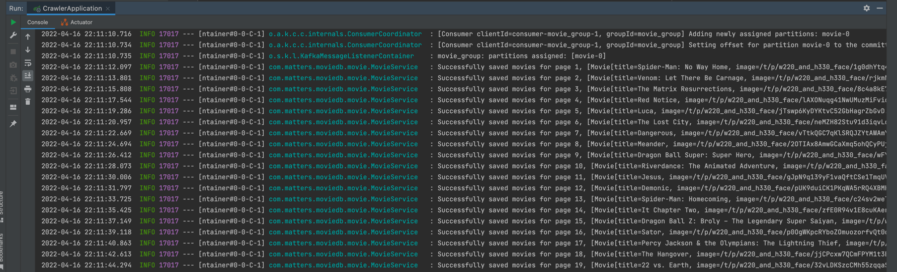
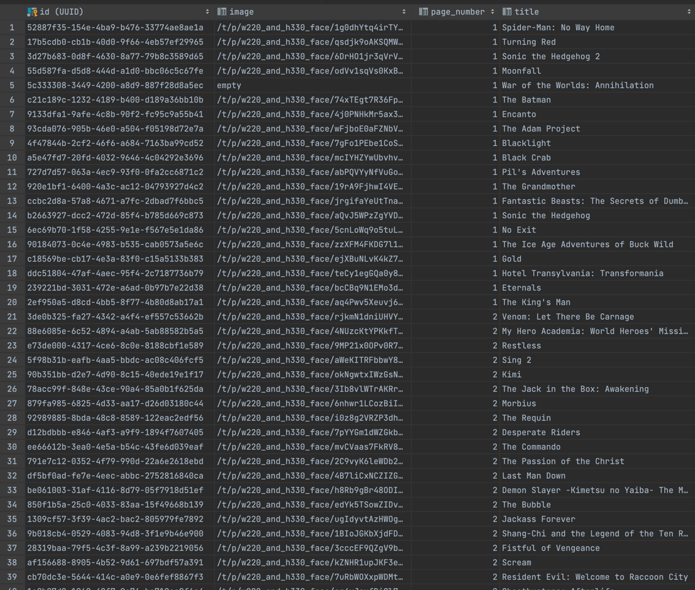

# MovieDB Crawler

## Project setup

1. Ensure that you have installed and running Docker and Docker-compose
    * Install Docker [Docker](https://www.docker.com/products/docker-desktop)
    * Install Docker-compose  [docker-compose](https://docs.docker.com/compose/install/)
2. Use **Java 17** for this project (Configure in **File-> Project Structure** for IntelliJ)
3. Run gradle bootJar to build project(from the root folder)
   ```
   gradle bootJar
   ```
4. Run command (from the root folder). It will start docker container(Kafka + Zookeeper)
   ```
   docker-compose up
   ```
5. Launch application
6. Check the logs and database, see the results are populated!

## Application logs



## Database content
